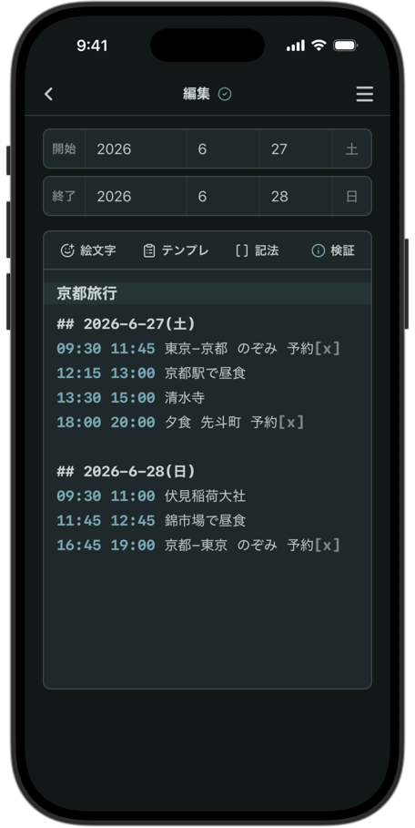

# Runbookle

Runbookle は [https://nacookan.github.io/runbookle/](https://nacookan.github.io/runbookle/) で利用できます。

Runbookle は、1日または数日間の行動予定を作るためのWebアプリです。旅行、出張、イベント参加日、複数予定がある日などに使う、時刻付きの行動メモ / 進行表に近いアプリを目指します。データはユーザー自身の Google Drive に保存します。

ユーザー名、メールアドレス、プロフィール画像は取得しません。作者のサーバーや作者のDBにも、ユーザーのメモや予定データを保存しません。



## 技術スタック

- Vite
- React
- TypeScript
- CSS Modules
- PWA最小設定
- GitHub Pages
- GitHub Actions
- Google Identity Services
- Google Drive API v3

## ローカル開発

```bash
npm install
npm run dev
```

Vite の `base` は `/runbookle/` に設定しています。ローカルでは次のURLで確認します。

```text
http://localhost:5173/runbookle/
```

## .env.local

ローカル開発では `.env.local` を作成し、Google OAuth Client ID を設定します。

```env
VITE_GOOGLE_CLIENT_ID=xxxxxxxxxxxx-xxxxxxxxxxxxxxxxxxxxxxxxxxxxxxxx.apps.googleusercontent.com
```

`VITE_GOOGLE_CLIENT_ID` は Google Identity Services のブラウザ向けOAuth連携に使う OAuth Client ID です。Client ID は秘密情報ではありませんが、環境ごとの差し替えを容易にし、ソースコードへ直書きしない方針です。

Client Secret は静的ホスティングのブラウザアプリでは使いません。ソースコード、環境変数、GitHub Actions のいずれにも設定しないでください。

## Google Cloud Console のOAuth設定

Google Cloud Console で OAuth クライアントを作成し、Google Drive API を有効化します。

- アプリケーションの種類: ウェブ アプリケーション
- 承認済みの JavaScript 生成元:
  - `http://localhost:5173`
  - `http://127.0.0.1:5173`
  - `https://<GitHubユーザー名>.github.io`
- 承認済みのリダイレクト URI: 今回の Google Identity Services OAuth token flow では不要

GitHub Pages の公開URLが `https://<GitHubユーザー名>.github.io/runbookle/` の場合でも、承認済み JavaScript 生成元には origin の `https://<GitHubユーザー名>.github.io` を登録します。

## Google Drive 保存

Google Drive API v3 を使い、ユーザー本人の Google Drive `appDataFolder` に次のファイルを保存します。

```text
runbookle-data.json
```

OAuth スコープは次のみです。

```text
https://www.googleapis.com/auth/drive.appdata
```

`drive.appdata` は、アプリ専用の隠しデータ領域である `appDataFolder` へアクセスするためのスコープです。通常のDriveファイル全体へのアクセス権限は要求しません。また、ユーザー名、メールアドレス、プロフィール画像を取得するスコープも要求しません。

保存形式はJSONです。

```json
{
  "schemaVersion": 1,
  "runbooks": [
    {
      "id": "string",
      "title": "string",
      "startDate": {
        "year": 2026,
        "month": 6,
        "day": 8,
        "precision": "day"
      },
      "endDate": {
        "mode": "none",
        "year": null,
        "month": null,
        "day": null,
        "precision": null
      },
      "archived": false,
      "text": "string",
      "createdAt": "ISO string",
      "updatedAt": "ISO string"
    }
  ],
  "updatedAt": "ISO string"
}
```

Drive上に `runbookle-data.json` がなければ作成し、あれば読み込みます。入力内容は `localStorage` にもキャッシュし、Drive読み込み前や保存失敗時にも最後のローカル内容を表示できるようにしています。

## 日付とアーカイブ

Runbook の開始日は未定を許可します。`startDate.precision` は次の値です。

```text
none, year, month, day
```

データ形式としては、終了日に「なし」「未定」「日付指定」を保持できます。

- `endDate.mode: "none"`: 1日だけの予定として扱います。
- `endDate.mode: "unknown"`: 終了日未定として扱います。
- `endDate.mode: "date"`: 終了日の年月日情報を使います。

現在のUIでは、終了日が空欄の場合は「なし」として扱います。

一覧画面は「今後の予定」と「アーカイブ」に分かれます。`archived: true` のRunbookと、日付が過ぎたRunbookはアーカイブに表示されます。過去日付のRunbookはアーカイブ解除できません。日付未定のRunbookは今後の予定に表示されます。

今後の予定は開始日の昇順で表示します。

## 本文エディタ

編集画面の本文エディタはプレーンテキストを保存します。1行目をRunbookのタイトル、2行目以降を本文として扱います。

編集画面ツールバーの「検証」から本文を簡易解析できます。`1000 1030` や `10:00 10:30` のように同じ行に開始時刻と終了時刻がある場合だけ、明らかな矛盾を検出します。

- 開始時刻より終了時刻が前の行
- 同じ日の中で時刻が前後している行
- 時間帯が重なっている予定
- 予定と予定の間の空き時間

行頭が `##` の行は、任意の日付区切りとして扱います。`## 2026-7-1` のように日付を書いても、`##` だけでも区切りになります。区切り内では、時刻順、時間帯の重なり、空き時間を検証します。区切りがない本文では、本文全体を1日の予定として検証します。

Markdown風チェックボックス記法の `- [ ]` と `- [x]` は、本文内ではプレーンテキストとして保存します。エディタ上ではクリックでチェック状態を切り替えられます。

時刻入力では、`1000` のような3桁または4桁の数字から `10:00` 形式への補完、既存時刻の前後調整候補、同じ行にある開始時刻と終了時刻からの所要時間表示を行います。

## GitHub Pages へのデプロイ

公開する段階になったら、GitHub リポジトリの Settings で Pages の Source を `GitHub Actions` に設定します。

GitHub Actions の Variables に次を登録します。

```text
VITE_GOOGLE_CLIENT_ID
```

登録場所は Repository settings の `Secrets and variables` -> `Actions` -> `Variables` です。Client ID は秘密情報ではないため Variables で扱います。

`main` ブランチへ push すると、`.github/workflows/deploy.yml` が `npm ci`、`npm run build` を実行し、`dist` を GitHub Pages にデプロイします。

## コマンド

```bash
npm run dev
npm run build
npm run preview
```
